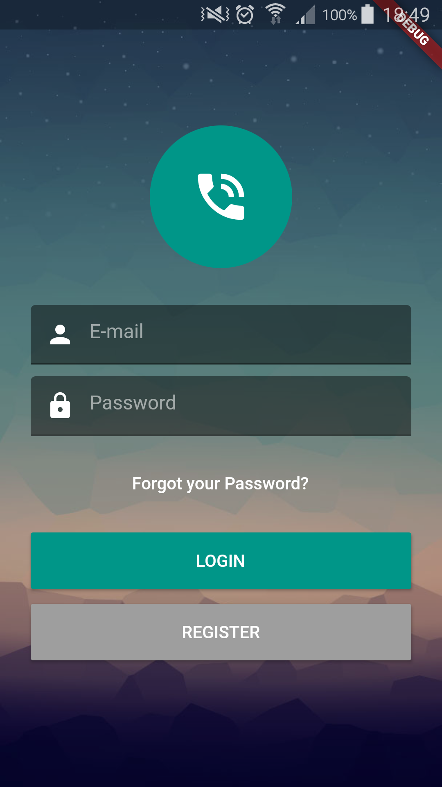
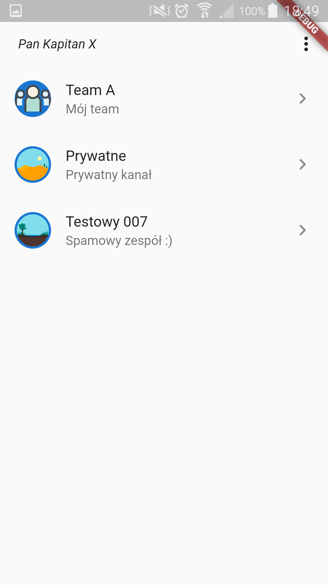
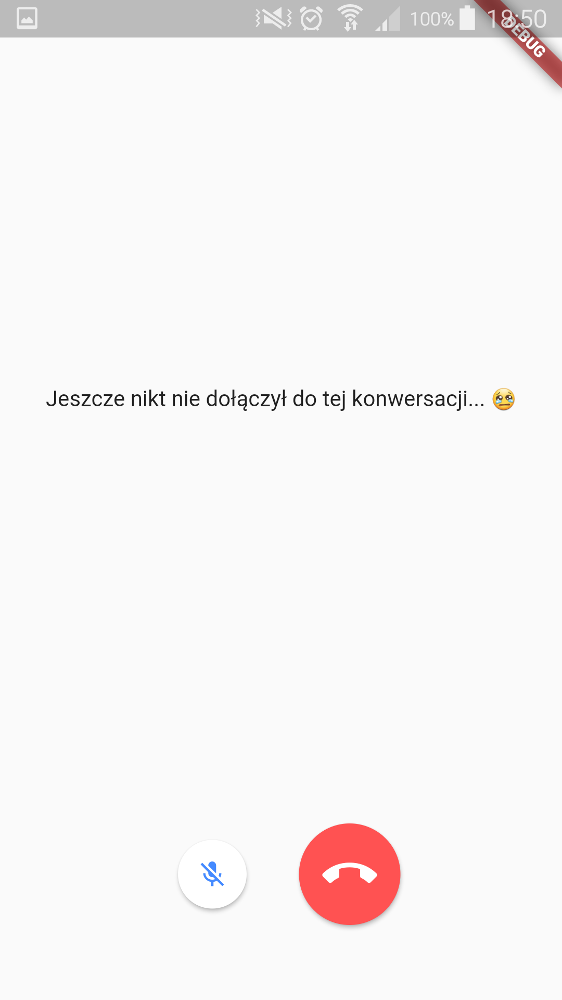

# quick_daily

Quick Daily mobile app!

## REST API for this app:
`https://github.com/marcinkazmierski/quick-daily-api`

## Getting Started

This project is a starting point for a Flutter application.

A few resources to get you started if this is your first Flutter project:

- [Lab: Write your first Flutter app](https://flutter.dev/docs/get-started/codelab)
- [Cookbook: Useful Flutter samples](https://flutter.dev/docs/cookbook)

For help getting started with Flutter, view our
[online documentation](https://flutter.dev/docs), which offers tutorials,
samples, guidance on mobile development, and a full API reference.

## BLoC
- https://bloclibrary.dev/

## Agora error codes:
- https://docs.agora.io/en/Video/API%20Reference/electron/index.html#error

## Dart
- `..` is known as cascade notation

## Screenshots:

## TODO:
- registration page
- `Transition { currentState: CallConnecting, event: OnCallError {}, nextState: CallError { error: AgoraRtcEngine: onError: 17 } }`
gdy przeładuje kod na widoku konwersacji to leci ten błąd. Tutaj bym musiał to obsłużyć
- back button override

### Integration and Unit testing in Flutter
- https://blog.usejournal.com/integration-and-unit-testing-in-flutter-f08e4bd961d5

### Compile time Dependency Injection in Flutter
- https://blog.usejournal.com/compile-time-dependency-injection-in-flutter-95bb190b4a71